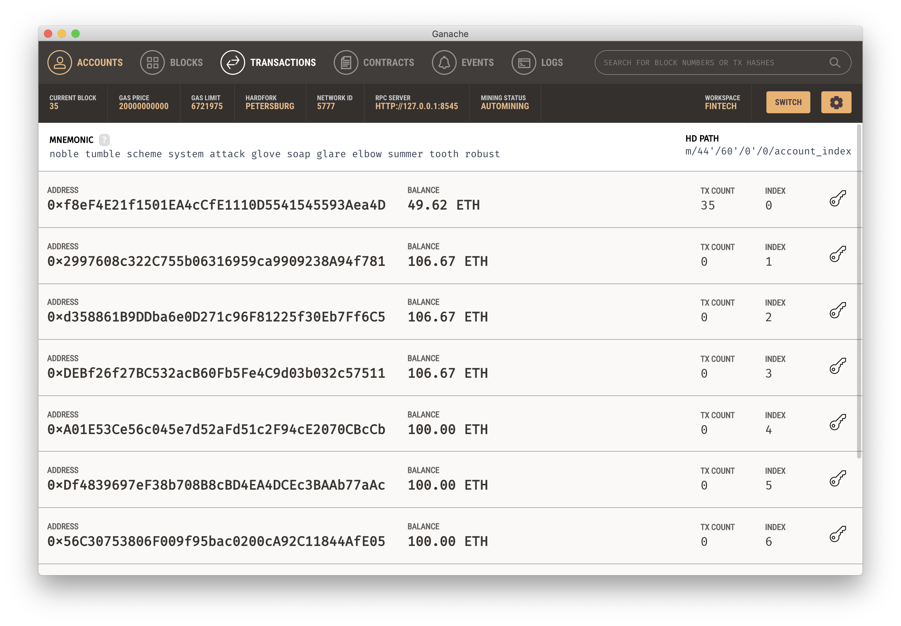
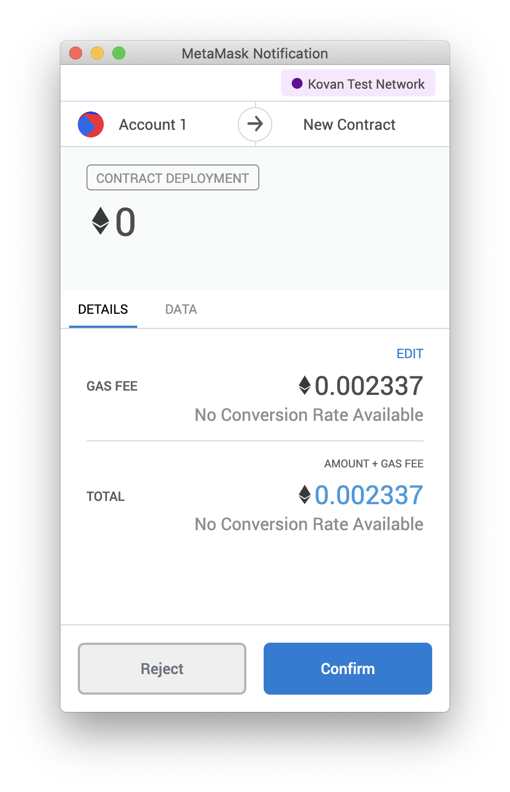
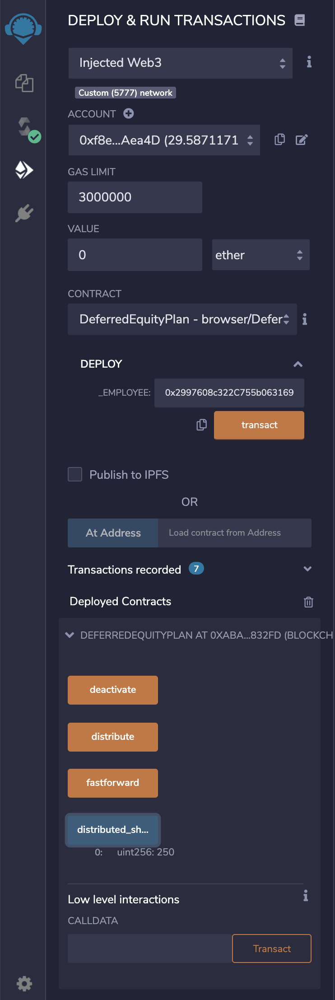

# Profit Splitter Smart Contracts

In this activity I create several ProfitSplitter smart contracts with Solidity to accomplish the following across 3 levels of difficulty:
* <b>Level One</b> is an AssociateProfitSplitter contract. This will accept Ether into the contract and divide the Ether evenly among the associate level employees. This will allow the Human Resources department to pay employees quickly and efficiently.
* <b>Level Two</b> is a TieredProfitSplitter that will distribute different percentages of incoming Ether to employees at different tiers/levels. For example, the CEO gets paid 60%, CTO 25%, and Bob gets 15%.
* <b>Level Three</b> is a DeferredEquityPlan that models traditional company stock plans. This contract will automatically manage 1000 shares with an annual distribution of 250 over 4 years for a single employee.

Here is a snapshot of my Ganache workspace before transactions are conducted:



---

### Level One: The AssociateProfitSplitter Contract

```
pragma solidity ^0.5.0;

// lvl 1: equal split
contract AssociateProfitSplitter {
    address payable employee_one;
    address payable employee_two;
    address payable employee_three;

    constructor(address payable _one, address payable _two, address payable _three) public {
        employee_one = _one;
        employee_two = _two;
        employee_three = _three;
    }

    function balance() public view returns(uint) {
        return address(this).balance;
    }

    function deposit() public payable {
        uint amount = msg.value / 3;

        employee_one.transfer(amount);
        employee_two.transfer(amount);
        employee_three.transfer(amount);

        msg.sender.transfer(msg.value - amount * 3);
    }

    function() external payable {
        deposit();
    }
}
```
The code accepts Ether into the contract, divides the Ether evenly among the three recipient addresses, transfers the calculated amount to the three recipient addresses, and then transfers the remainder back to the sender address.

After successfully compiling the code, we switch the ENVIRONMENT to "Injected Web3" in the dropdown menu in Remix. We paste the three recipient addresses within the DEPLOY area and select "transact" (a value of 0 wei) to deploy our contract to the local network:


MetaMask pops up and we "Confirm" the contract deployment:


Now we can click an arrow beside "ASSOCIATEPROFITSPLITTER" in Remix to see our options to "deposit" or check "balance." We enter a VALUE of 10 ether to deposit:


MetaMask again pops up and we confirm the transaction: 


We can see in Ganache that the deposit worked!


Now we can point our MetaMask to the Kovan Test Network! We first check our balance in MetaMask on the Kovan Test Network:


We successfully compile our code. Then we change the ENVIRONMENT to Injected Web3 and populate the three recipient addresses under DEPLOY: 


We confirm in MetMask:


This generates our option buttons to "deposit" or check "balance" in the lower left. We choose to "deposit" a VALUE of 0.1 ether:


We confirm our deposit in MetaMask:


We can see that the deposit worked and our account balance has decreased:


We double-check etherscan to determine that the deposit was successfully routed into the three recipient accounts, as well as the remainder of 1 wei that goes back into the sender account:


The testnet address for others to be able to send to is: 0xf8eF4E21f1501EA4cCfE1110D5541545593Aea4D.

### Level Two: The TieredProfitSplitter Contract

```
pragma solidity ^0.5.0;

// lvl 2: tiered split
contract TieredProfitSplitter {
    address payable employee_one; // ceo
    address payable employee_two; // cto
    address payable employee_three; // bob

    constructor(address payable _one, address payable _two, address payable _three) public {
        employee_one = _one;
        employee_two = _two;
        employee_three = _three;
    }

    // Should always return 0! Use this to test your `deposit` function's logic
    function balance() public view returns(uint) {
        return address(this).balance;
    }

    function deposit() public payable {
        uint points = msg.value / 100; // Calculates rudimentary percentage by dividing msg.value into 100 units
        uint total;
        uint amount;

        // @TODO: Calculate and transfer the distribution percentage
        // Step 1: Set amount to equal `points` * the number of percentage points for this employee
        // Step 2: Add the `amount` to `total` to keep a running total
        // Step 3: Transfer the `amount` to the employee
        
        amount = points * 60;
        total += amount;
        employee_one.transfer(amount);
        
        // @TODO: Repeat the previous steps for `employee_two` and `employee_three`

        amount = points * 25;
        total += amount;
        employee_two.transfer(amount);
        
        amount = points * 15;
        total += amount;
        employee_three.transfer(amount);

        employee_one.transfer(msg.value - total); // ceo gets the remaining wei
    }

    function() external payable {
        deposit();
    }
}
```

The code calculates one percentage of the transferred amount and then splits it among three recipient accounts with different tiers of compensation. It also keeps a running total of the amounts transferred to each employee and then transfers any remainder to the employee with the highest percentage by subtracting the running total from msg.value. 

We switch back to our Localhost 8545 network and successfully compile the code, then switch the ENVIRONMENT to Injected Web3. We enter the three recipient addresses and click "transact" with a VALUE of 0 wei:


MetaMask pops up and we Confirm:


Now we can view the dropdown "deposit" and "balance" buttons in the lower left of Remix. We choose to transfer a VALUE of 10 ether and click "deposit":


MetaMask pops up and we confirm the deposit:


We are able to see in Ganache that our deposits were successful and our account balances have updated!


Now we switch back to the Kovan Test Network in MetaMask:


We successfully compile the code, switch the Remix ENVIRONMENT to Injected Web3, enter the three recipient addresses, and "transact" 0 wei to deploy the contract. We Confirm in MetaMask:



Now we can see "TIEREDPROFITSPLITTER" in the lower-left dropdown which reveals the "deposit" and "balance" buttons. We choose a VALUE of 0.1 ether to deposit:


We Confirm in the MetaMask Notification popup: 


We can see the transaction "pending":


We can use MetaMask to view the transaction details and confirm successful execution:


We now check the "balance" which is 0, as expected:


Again, the testnet address for others to be able to send to is: 0xf8eF4E21f1501EA4cCfE1110D5541545593Aea4D.

### Level Three: The DeferredEquityPlan Contract

```
pragma solidity ^0.5.0;

// lvl 3: equity plan
contract DeferredEquityPlan {
    uint fakenow = now;
    function fastforward() public {
        fakenow += 100 days;
    }
    address human_resources;

    address payable employee; // bob
    bool active = true; // this employee is active at the start of the contract

    // @TODO: Set the total shares and annual distribution
    uint total_shares = 1000;
    uint annual_distribution = 250;
    

    uint start_time = fakenow; // permanently store the time this contract was initialized

    // @TODO: Set the `unlock_time` to be 365 days from now
    uint unlock_time = fakenow + 365 days;

    uint public distributed_shares; // starts at 0

    constructor(address payable _employee) public {
        human_resources = msg.sender;
        employee = _employee;
    }

    function distribute() public {
        require(msg.sender == human_resources || msg.sender == employee, "You are not authorized to execute this contract.");
        require(active == true, "Contract not active.");

        // @TODO: Add "require" statements to enforce that:
        // 1: `unlock_time` is less than or equal to `now`
        require(unlock_time <= fakenow,  "Account is locked!");
        // 2: `distributed_shares` is less than the `total_shares`
        require(distributed_shares < total_shares, "Available shares have been exceeded!");

        // @TODO: Add 365 days to the `unlock_time`
        unlock_time += 365 days;

        // @TODO: Calculate the shares distributed by using the function (now - start_time) / 365 days * the annual distribution
        // Make sure to include the parenthesis around (now - start_time) to get accurate results!
        distributed_shares = (fakenow - start_time) / 365 days * annual_distribution;

        // double check in case the employee does not cash out until after 5+ years
        if (distributed_shares > 1000) {
            distributed_shares = 1000;
        }
    }

    // human_resources and the employee can deactivate this contract at-will
    function deactivate() public {
        require(msg.sender == human_resources || msg.sender == employee, "You are not authorized to deactivate this contract.");
        active = false;
    }

    // Since we do not need to handle Ether in this contract, revert any Ether sent to the contract directly
    function() external payable {
        revert("Do not send Ether to this contract!");
    }
}

```

The code works by keeping track of how much time has passed since the start_time, and storing and setting amounts that represent the number of distributed shares the employee owns, enforcing the vetting periods automatically. We use a "fakenow" variable that allows us to skip through time for testing purposes.

We switch back to our Localhost 8545 network and successfully compile the code, then switch the ENVIRONMENT to Injected Web3. We enter the recipient address and click "transact" with a VALUE of 0 wei:


We confirm the deployment in the MetaMask popup:


Now we can see the "deactivate," "distribute," "fastforward," and "distributed_shares" buttons in the lower-left dropdown. We choose "distributed_shares" and see that there are 0 distributed shares:


We then choose "fastforward" and Confirm in the MetaMask popup:


We still see 0 distributed shares because not enough time has passed, so we click "fastforward" three more times, confirming in the MetaMask popup each time. Now we are able to choose "distribute" and Confirm in the MetaMask popup. Now when we click "distributed_share" we see there are 250 distributed shares, as expected!



We can see these recent transactions in Ganache:


Now we switch back to the Kovan Test Network in MetaMask, successfully compile the code, switch the Remix ENVIRONMENT to Injected Web3, enter the  recipient address, and "transact" 0 wei to deploy the contract:


We Confirm in MetaMask:


The testnet address for others to be able to send to is: 0xf8eF4E21f1501EA4cCfE1110D5541545593Aea4D.